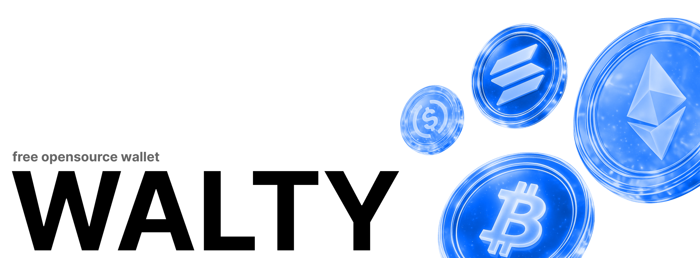

<div align="center">
  <a href="#">
    
  </a>

  <h1>Walty</h1>

  <p>Walty is a free and open-source self-custodial wallet for EVM networks.</p>

  <p><a href="#quick-start">Get Started</a> · <a href="#documentation">Documentation</a> · <a href="#contributing">Contributing</a></p>
</div>

---

Walty helps you manage crypto assets across Ethereum-compatible networks from a single interface. You can create or recover a wallet, track balances and portfolio value, send native/ERC-20 tokens, and execute swaps with quote aggregation.

The wallet follows a self-custody model: seed material is encrypted locally in the browser and transaction signing happens client-side.

## Features

**Wallet Management**

- BIP-39 mnemonic generation with 24-word seed phrases
- Local encryption using AES-GCM with PBKDF2 (210,000 iterations)
- Auto-lock after 5 minutes of inactivity or immediate lock on tab blur
- Export and import encrypted wallet backups
- Server-verified wallet linking via cryptographic nonce signatures

**Multi-Chain Support**

- Native support for Ethereum, Arbitrum, Base, Optimism, and Polygon
- View token balances across all supported chains
- Token portfolio with USD value calculations
- ERC-20 token support with multicall balance queries

**Transactions**

- Send ETH and tokens with real-time gas estimation
- Transaction history with on-chain status synchronization
- Automatic transaction status updates on wallet unlock
- Etherscan integration for transaction tracking

**Token Swaps**

- Swap tokens using 0x Protocol aggregation
- Price quotes with real-time market data
- Automatic ERC-20 approval handling
- Transaction simulation before execution

**Privacy & Security**

- Self-host on your own infrastructure
- No tracking or analytics by default
- Client-side key handling and signing flow

**User Experience**

- Multi-language support (English and Spanish)
- Dark mode with theme persistence
- Responsive design with mobile support
- ENS name resolution for Ethereum addresses
- Contact management for saved addresses

## Requirements

**Required:**
- [Docker](https://www.docker.com/get-started) (version 20.10 or later)
- [Docker Compose](https://docs.docker.com/compose/install/) (version 2.0 or later, usually included with Docker Desktop)
- Git (to clone the repository)

**Optional:**
- `openssl` (for generating secure random strings - usually pre-installed on Linux/Mac, or use any online random string generator)

**Not required:**
- Node.js, pnpm, or any other build tools (everything builds inside Docker containers)
- PostgreSQL (runs in a Docker container)

## Quick Start

Recommended local setup (full stack with Docker):

```bash
# Clone the repository
git clone https://github.com/ignaciogarcia-dev/walty.git
cd walty

# Copy the environment variables template
cp .env.example .env

# Build and start all services (app + postgres)
docker compose up --build

# Access the app
open http://localhost:3000
```

Database migrations run automatically on container startup.

For detailed setup and troubleshooting, see [docs/getting-started.md](docs/getting-started.md).

## Environment Variables

Environment configuration is documented in `.env.example`. Most setups only need:

**Required**

- `DATABASE_URL`
- `JWT_SECRET`
- `SERVER_PEPPER`

**Recommended**

- `ALCHEMY_API_KEY`

**Optional**

- `ZEROX_API_KEY`
- `ANKR_API_KEY`
- `ONEINCH_API_KEY`
- `COINGECKO_API_KEY`
- `COINGECKO_API_BASE_URL`
- `COOKIE_SECURE`

## Documentation

| File | Purpose |
| --- | --- |
| [docs/README.md](docs/README.md) | Documentation index |
| [docs/getting-started.md](docs/getting-started.md) | Setup and local run guide |
| [docs/development.md](docs/development.md) | Development workflow and scripts |
| [docs/architecture.md](docs/architecture.md) | Codebase architecture and data flow |
| [docs/roadmap.md](docs/roadmap.md) | Priorities and contribution directions |
| [CONTRIBUTING.md](CONTRIBUTING.md) | Rules for opening issues and PRs |
| [CODE_OF_CONDUCT.md](CODE_OF_CONDUCT.md) | Community behavior expectations |

## Development

Common commands:

```bash
pnpm lint
pnpm build
pnpm db:migrate
pnpm db:studio
```

The recommended workflow for most contributions is documented in [docs/development.md](docs/development.md).

## Self-Hosting

Walty can be self-hosted using Docker. PostgreSQL runs as part of the stack, and migrations are applied automatically on startup.

Build from source:

```bash
# Copy the environment variables template
cp .env.example .env

# Edit .env and configure the values you need
# - DATABASE_URL is already configured for Docker Compose
# - JWT_SECRET and SERVER_PEPPER are required
# - ALCHEMY_API_KEY is recommended
# - ZEROX_API_KEY is needed for swaps
# - See .env.example for the full list of optional variables

docker compose up --build
```

See [.env.example](.env.example) for all available variables.

## Contributing

Walty uses an issue-first contribution model to keep work predictable and reviewable.

Core rules:

- Non-trivial changes start with a GitHub issue before code is written.
- One issue should map to one pull request whenever possible.
- Pull requests must include linked issue, scope, and validation notes.
- Small docs/typo fixes can go directly to PR.

Start here:

- [CONTRIBUTING.md](CONTRIBUTING.md)
- [.github/ISSUE_TEMPLATE](.github/ISSUE_TEMPLATE)
- [.github/PULL_REQUEST_TEMPLATE.md](.github/PULL_REQUEST_TEMPLATE.md)
- [docs/roadmap.md](docs/roadmap.md)

## Community Workflow (Issue-First)

1. Open or pick an issue (`bug`, `feature`, `proposal`, `good first issue`).
2. Wait for scope confirmation on larger features/refactors.
3. Comment that you are taking the issue.
4. Open a PR linked to that issue (`Closes #123`).
5. Iterate with review until merge.

## License

[MIT](LICENSE)
