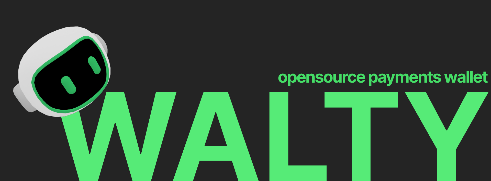

<div align="center">
  <a href="#">
    
  </a>

  <h1>Walty</h1>

  <p>Accept and send crypto payments. For businesses and everyday people.</p>

  <p><a href="#quick-start">Get Started</a> · <a href="#documentation">Documentation</a> · <a href="#contributing">Contributing</a></p>
</div>

---

Walty is a self-custodial crypto payment platform for EVM networks. It supports
personal wallets and business payment operations without a backend signer.

## Current Product Surface

### For businesses

- Generate payment requests with a USD amount, payable in `USDC` or `USDT` on Polygon
- Share QR codes or payment links with customers
- Track payment status with on-chain reconciliation
- Support split payments with multiple contributions
- Invite cashiers with expiring invite links
- Assign HD-derived cashier wallets and collect funds back to the owner wallet
- Create and execute refund flows through transaction intents
- Keep an audit trail for business actions

### For people

- Create or recover a non-custodial wallet
- Send native tokens and ERC-20 tokens
- Pay business payment requests
- View a multichain portfolio
- Manage contacts and username-based recipients
- Track wallet activity

## Supported Networks

The codebase supports:

- Ethereum
- Arbitrum
- Base
- Optimism
- Polygon

What users see in the UI is filtered by `NEXT_PUBLIC_ENABLED_CHAINS`. The
default `.env.example` currently exposes Polygon only.

## Wallet and Security Model

- seed phrase generated locally in the browser
- local wallet stored as an encrypted V3 payload
- optional server-side backup stores the same encrypted payload shape
- transaction signing happens client-side
- JWT session stored in an `HttpOnly` cookie
- CSP nonce and basic hardening headers set in `middleware.ts`

## Quick Start

Recommended local setup:

```bash
git clone https://github.com/ignaciogarcia-dev/walty.git
cd walty

cp .env.example .env
docker compose -f compose.dev.yml up -d

pnpm install
pnpm db:migrate
pnpm dev
```

Open `http://localhost:3000`.

Notes:

- `compose.dev.yml` starts only PostgreSQL for local development.
- `docker-compose.yml` is a production-style app container and expects an
  external PostgreSQL database.

## Environment Variables

Required:

- `DATABASE_URL`
- `JWT_SECRET`

Required for blockchain-enabled usage:

- `ALCHEMY_API_KEY`
- `NEXT_PUBLIC_ALCHEMY_API_KEY`

Required for payment reconciliation:

- `PAYMENTS_RECONCILE_SECRET`

Optional:

- `ANKR_API_KEY`
- `COINGECKO_API_KEY`
- `NEXT_PUBLIC_ENABLED_CHAINS`
- `COOKIE_SECURE`

## Documentation

| File | Purpose |
| --- | --- |
| [docs/README.md](docs/README.md) | Public documentation index |
| [docs/getting-started.md](docs/getting-started.md) | Setup and local run guide |
| [docs/development.md](docs/development.md) | Development workflow and scripts |
| [docs/architecture.md](docs/architecture.md) | High-level architecture summary |
| [docs/repository-map.md](docs/repository-map.md) | Compact repository map |
| [docs/roadmap.md](docs/roadmap.md) | Current priorities |

## Development

Common commands:

```bash
pnpm dev
pnpm lint
pnpm test:run
pnpm build
pnpm db:migrate
pnpm db:studio
```

For the detailed workflow, read [docs/development.md](docs/development.md).

## Contributing

Walty uses an issue-first contribution model.

Core rules:

- non-trivial changes should start with an issue
- one issue should map to one PR whenever possible
- PRs should include scope, validation, and linked issue
- structural changes should update the relevant docs

Start here:

- [CONTRIBUTING.md](CONTRIBUTING.md)
- [docs/README.md](docs/README.md)

## License

[MIT](LICENSE)
